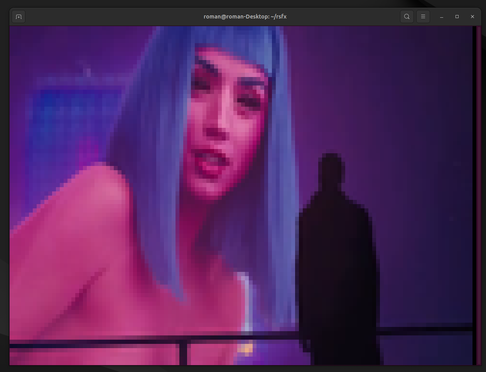

<p align="center">
  
</p>

<p align="center">
  
  
  
  
</p>

Terminal video player and rendering engine. Converts MP4 videos into a pre-rendered binary format optimized for terminal playback with synchronized audio.

Uses Unicode half-block characters (`▄`) with 24-bit ANSI color to render 2 vertical pixels per character cell — no Kitty/Sixel support required. Works on any modern terminal.

<p align="center">
  
</p>

## How it works

1. **Convert** — Decode video with FFmpeg, resize frames to terminal dimensions, encode each cell as a background/foreground color pair, delta-compress between frames, extract audio as raw PCM. Write everything to a single `.rsfx` file.
2. **Play** — Read the `.rsfx` file, decompress frames on the fly, render ANSI escape sequences to stdout, play audio via the system output device. Audio clock drives frame sync.

An 80x24 terminal gives 80x48 effective pixel resolution at full RGB color depth.

## Quick start

```
cargo run -p rsfx-convert -- you_look_lonely.mp4 --cols 120 --rows 40
cargo run -p rsfx-play -- you_look_lonely.rsfx
```

Or if installed to PATH (`cargo install --path converter --path player`):

```
rsfx-convert you_look_lonely.mp4 --cols 120 --rows 40
rsfx-play you_look_lonely.rsfx
```

Press `q` or `Esc` to quit during playback.

### Converter options

| Flag | Default | Description |
|------|---------|-------------|
| `--cols` | 120 | Terminal width in columns |
| `--rows` | 40 | Terminal height in rows |
| `--fps` | 30 | Target frame rate |
| `--keyframe-interval` | 30 | Frames between full keyframes |
| `-o, --output` | `<input>.rsfx` | Output file path |

## .rsfx format

```
[Header 64B] [Frame 0] [Frame 1] ... [Frame N] [Audio PCM] [Frame Index]
```

- **Header** — Magic, dimensions, FPS, frame count, audio metadata, offsets
- **Frames** — LZ4-compressed. Keyframes store the full cell grid (6 bytes/cell). Delta frames store only changed cells (10 bytes each)
- **Audio** — Raw PCM s16le, 44100 Hz, stereo
- **Index** — Frame offset table written at EOF, referenced by header

## Project structure

```
rsfx-core/     Shared format types, binary encode/decode, LZ4 compression
converter/     MP4 to .rsfx conversion pipeline (rsfx-convert)
player/        Terminal playback engine with audio sync (rsfx-play)
```

## Requirements

- Rust 1.70+
- FFmpeg installed and available on `PATH`
- A terminal with 24-bit color support

## Building

```
cargo build --workspace --release
```

## License

Apache 2.0
